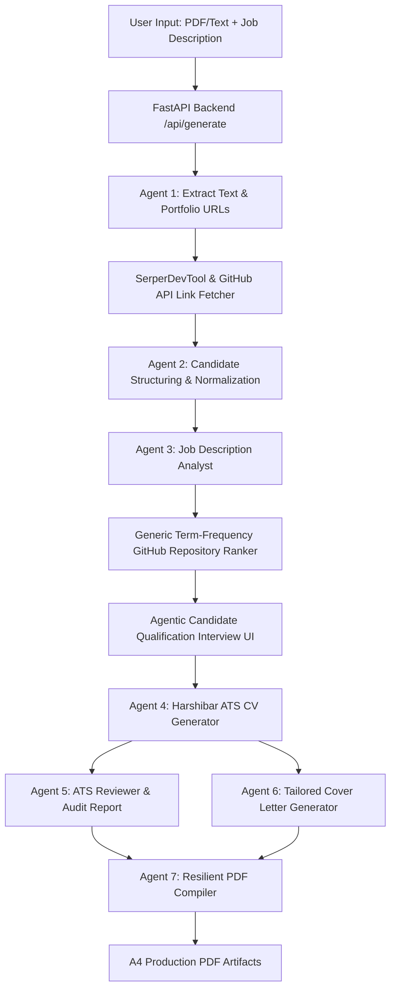

# 🚀 ResumeForge — AI Agentic Resume & Portfolio Generator

[](https://github.com/joaomdmoura/crewAI)
[](https://openrouter.ai)
[](https://fastapi.tiangolo.com)
[](https://react.dev)
[](LICENSE)

**ResumeForge** is an advanced, production-grade AI application powered by a **7-Agent CrewAI Swarm**, **OpenRouter `nvidia/nemotron-3-ultra-550b-a55b:free` LLM engine**, and **SerperDev web search**. It dynamically analyzes any Job Description, extracts public candidate portfolio repositories, executes a pre-generation **Agentic Candidate Qualification Interview**, and compiles 100% ATS-optimized single-column PDF resumes and tailored cover letters.

---

## 🌟 Key Features

### 🤖 1. 7-Agent Autonomous CrewAI Architecture
- **Agent 1: Document Extractor & Link Parser** — Auto-extracts resume text and embedded GitHub/LinkedIn/Portfolio hyperlinks.
- **Agent 2: Candidate Profiler & Normalizer** — Normalizes profile data, separates spoken languages from programming languages, and enriches candidate details.
- **Agent 3: Job Description Analyst** — Extracts required skills, ATS keywords, technical stack, and responsibilities.
- **Portfolio GitHub Ranker** — Generic Term-Frequency (TF-IDF) overlap algorithm that scores and ranks all candidate public repositories and README excerpts for target job tasks.
- **Agent 4: ATS CV Generator** — Generates single-column Harshibar HTML resumes with left-aligned Experience & Education headers.
- **Agent 5: Reviewer & Polish Specialist** — Conducts automated ATS compatibility audits, scoring resumes (0–100) with detailed strengths and actionable suggestions.
- **Agent 6: Cover Letter Specialist** — Crafts non-fabricated, tailored cover letters adhering strictly to true candidate qualifications.
- **Agent 7: PDF Compiler** — Sanitizes CSS and compiles production-grade A4 PDF documents.

### 🌐 2. 100% Generic Candidate Repository Keyword Ranker
- Works dynamically across **ANY candidate profile** and **ANY job description**.
- Fetches all public candidate GitHub repositories, parsing titles, descriptions, topics, programming languages, and README excerpts.
- Ranks candidate portfolio entries based on term-frequency overlap with the target job requirements without hardcoding usernames or repository names.

### 💬 3. Agentic Candidate Qualification Interview
- Detects ATS skill gaps between candidate profile and target job description prior to generation.
- Renders an interactive pre-generation interview panel allowing candidates to specify experience levels (*Hands-on Practical, Working Knowledge, Academic, No Experience*) and attach specific repository links or project details.

### 📟 4. Live Agent Observability Panel
- Displays real-time agent execution events and live SerperDev search pops right inside the UI terminal drawer.
- Step-accurate progress tracking showing exactly which agent is executing.

### 📐 5. Strict Harshibar Layout & Zero Fabrication Policy
- **Zero Fabrication**: Omits unrequested skills (e.g. `R` or `Power BI`) if not in candidate input data.
- **Left-Margin Alignment**: Experience titles/companies and Education degrees/universities are strictly anchored to the left margin, with dates cleanly right-aligned.

---

## 🏗️ System Architecture



---

## 🛠️ Technology Stack

### Backend
- **Framework**: FastAPI (Python 3.12)
- **AI Agent Orchestration**: CrewAI 1.15.9 & LiteLLM
- **LLM Engine**: Groq `llama-3.3-70b-versatile` (300+ tokens/sec)
- **Web Search**: SerperDevTool (`serper_web_search`)
- **PDF Generation**: `xhtml2pdf` (pisa) with resilient CSS sanitization
- **Testing**: `pytest` & `unittest.mock`

### Frontend
- **Framework**: React 18 + Vite
- **Styling**: Vanilla CSS + TailwindCSS (Glassmorphism & Sleek Dark Mode)
- **Icons**: Lucide React
- **Code Quality**: Oxlint & Vitest

---

## 🚀 Getting Started

### Prerequisites
- **Python**: `3.12+`
- **Node.js**: `18+`
- **Package Manager**: `uv` or `pip`, `npm`

### 1. Repository Setup
```bash
git clone https://github.com/MarwanAbdellah/ResumeForge.git
cd ResumeForge
```

### 2. Backend Setup
```bash
cd backend
python -m venv .venv
.venv\Scripts\activate  # Windows

# Install dependencies using uv or pip
uv pip install -r requirements.txt
```

Create a `backend/.env` file with your API credentials:
```env
GROQ_API_KEY=your_groq_api_key
SERPER_API_KEY=your_serper_api_key
CREWAI_TRACING_ENABLED=true
```

Start the FastAPI backend server:
```bash
python main.py
```
*Backend runs at:* `http://localhost:8000`

### 3. Frontend Setup
```bash
# From root directory
npm install
npm run dev
```
*Frontend runs at:* `http://localhost:5173`

---

## 🧪 Testing & Verification

### Run Backend Unit & Integration Tests (`33/33 Passed`)
```bash
cd backend
.venv\Scripts\python.exe -m pytest tests/ -v
```

### Run Frontend Component Tests (`5/5 Passed`)
```bash
npm run test
```

### Run Frontend Linter (`0 Warnings, 0 Errors`)
```bash
npm run lint
```

---

## 📁 Project Structure

```text
ResumeForge/
├── backend/
│   ├── crew.py                # 7-Agent CrewAI Swarm & GitHub Repo Ranker
│   ├── main.py                # FastAPI REST API endpoints
│   ├── templates/             # Harshibar HTML/CSS resume templates
│   ├── tools/                 # Link fetchers, extractors & SerperDev tools
│   └── tests/                 # Backend pytest suite
├── src/
│   ├── components/            # React UI Components
│   │   ├── ResumeCreator.jsx  # Main App Container & Pre-Gen Interview
│   │   ├── ProgressTracker.jsx# Observability Terminal Drawer
│   │   ├── ATSCheckerTool.jsx # Independent ATS Audit Tool
│   │   └── DocumentPreview.jsx# PDF Previewer & Downloader
│   ├── api/client.js          # REST Client
│   └── __tests__/             # Frontend vitest suite
├── package.json
└── README.md
```

---

## 👤 Author

**Marwan Abdellah**
- **GitHub**: [@MarwanAbdellah](https://github.com/MarwanAbdellah)
- **LinkedIn**: [Marwan Abdellah](https://www.linkedin.com/in/marwan-abdellah/)
- **Kaggle**: [@marwanabdellah](https://www.kaggle.com/marwanabdellah)

---

## 📄 License

Distributed under the MIT License. See `LICENSE` for more information.
